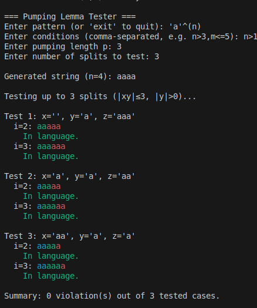

# Pumping Lemma Tester -Demo

A command-line C++ tool to experiment with the pumping lemma for regular languages. It parses symbolic patterns of the form `'a'^(expr)` (and optionally `'b'^(expr)` with two parameters `n` and `m`), generates strings, and tests whether the pumping lemma is violated for a user-specified number of splits.

---

## Features

* **Flexible Pattern Parsing**: Supports nested arithmetic expressions (`+`, `-`, `*`, `/`, `^`) and variables `n`, `m` within exponents.
* **Condition Constraints**: Allows comma-separated conditions on parameters, e.g., `n>3`, `m<=2`, `n+m>5`.
* **Integer-Safe Arithmetic**: All arithmetic uses integer-safe exponentiation and avoids floating-point inaccuracies.
* **Configurable Depth**: Prevents stack overflow with a configurable recursion-depth guard.
* **Customizable Testing**: User chooses the pumping length `p` and the number of splits (test cases) to examine.
* **Colored Output**: Terminal output is colorized for readability.

---

## Getting Started

### Prerequisites

* A C++17 compatible compiler (e.g., `g++`, `clang++`).

### Building

```bash
# Clone the repository
git clone https://github.com/MohamedElsadany56/PumpingLemmaDemonstrator.git
cd PumpingLemmaDemonstrator

# Compile
g++ -std=c++17 -O2 -Iinclude src/*.cpp -o pumping_lemma
```

### Running

```bash
./pumping_lemma
```

Example interactive session:

```
=== Pumping Lemma Tester ===
Enter pattern (or 'exit' to quit): 'a'^(n) 
Enter conditions (comma-separated, e.g. n>3,m<=5): n>1
Enter pumping length p: 3
Enter number of splits to test: 3

Generated string (n=4): aaaa

Testing up to 3 splits (|xy|≤3, |y|>0)...

Test 1: x='', y='a', z='aaa'
  i=2: aaaaa
    In language.
  i=3: aaaaaa
    In language.

Test 2: x='a', y='a', z='aa'
  i=2: aaaaa
    In language.
  i=3: aaaaaa
    In language.

Test 3: x='aa', y='a', z='a'
  i=2: aaaaa
    In language.
  i=3: aaaaaa
    In language.

Summary: 0 violation(s) out of 3 tested cases.
```

---

## Code Structure

* **main.cpp**: Implements all logic, divided into sections:

  * Configuration constants
  * Utility functions (`trim`, `colorize`, `pow_int`)
  * Expression evaluator (`eval_expr`)
  * Pattern parser (`parse_pattern`)
  * Condition checker (`check_conditions`)
  * String generator (`generate_string`)
  * Pumping tests (`test_pumping_cases`, `find_valid_n_m`)

---

## Contributing

1. Fork the repository
2. Create a feature branch (`git checkout -b feature/YourFeature`)
3. Commit your changes (`git commit -m "Add some feature"`)
4. Push to the branch (`git push origin feature/YourFeature`)
5. Open a pull request

---

## License

MIT License © \Mohamed Goma

---

*Last updated: May 2025*
